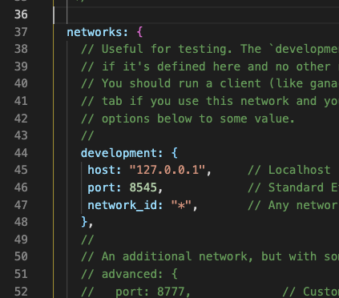

## truffle 사용하여 Lottery앱 만들기

1. 프로젝트 생성하기
```
$ truffle init
```
<pre>
- contract
ㄴ Migrations.sol
- migrations
ㄴ 1_initial_migration.js
- test
ㄴ .gitkeep
- truffle-config.js
</pre>
형태로 프로젝트가 생성된다

2. solidity파일 생성 후 컴파일하기
```
pragma solidity ^0.8.0;
contract Lottery {

}
```
```
$ truffle compile
```
컴파일을 하면 build/contracts 폴더 내에
Lottery.json과 Migrations.json파일이 생성된다.

3. migrations파일 수정하기
```
/* migrations/2_deploy_smart_contrac.js */

const Lottery = artifacts.require("Lottery");
// artifacts.require로 build폴더(compile을 통해 생성된)에 있는 Lottery.json을 불러온다.

module.exports = function (deployer) {
  // 가져온 JSON파일을 배포한다.
  deployer.deploy(Lottery);
};
```

4. truffle-config에서 network설정하기



5. bytes 타입
bytes타입은 bytes1 ~ bytes32까지 있고,
```
bytes1 b1 = 0xab;
bytes2 b2 = 0xabcd;

```
이런식으로 사용할 수 있다.